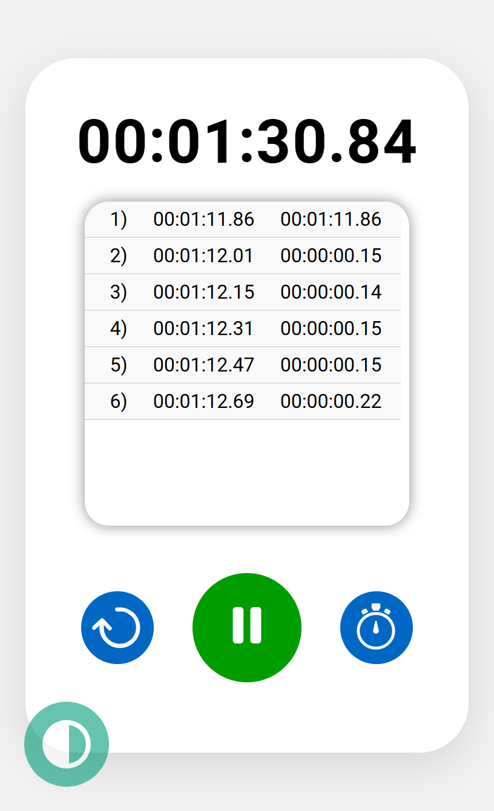
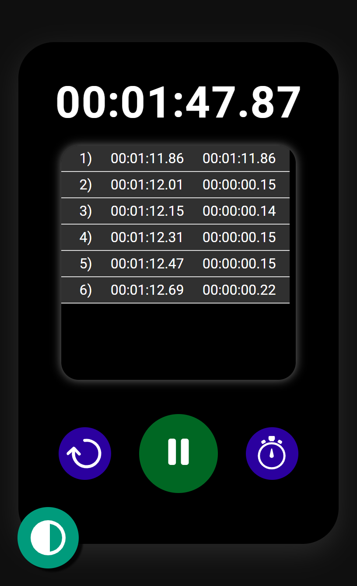
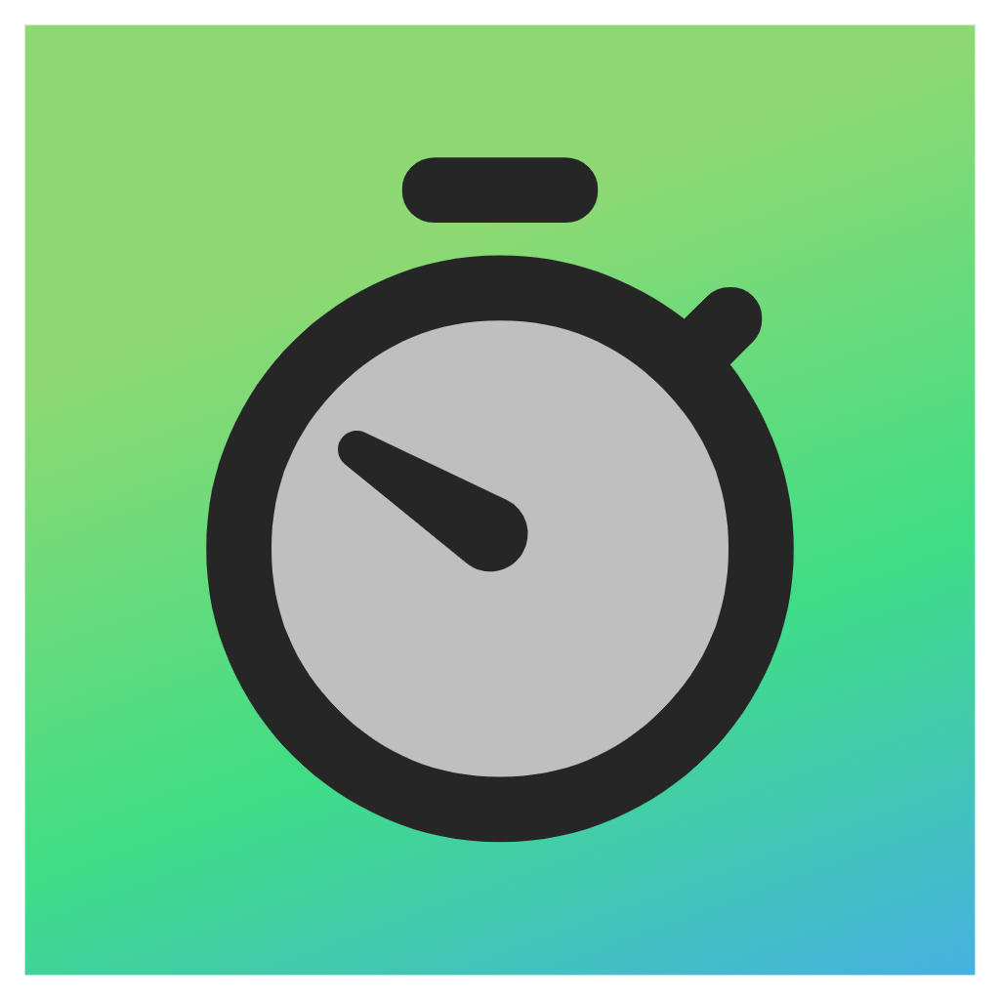

# Stopwatch ⏱️

This is a simple stopwatch application. It allows you to perform the following actions:

1. **Start**: Begin the stopwatch.
2. **Lap**: Record a lap time.
3. **Reset**: Reset the stopwatch to zero.

Additionally, there's a draggable theme-changing button. When you tap it, the theme changes. If you reload the page, your theme selection will be remembered using `localStorage`. If no theme is selected, the stopwatch will default to the device theme.

## How to Use

1. Download this repository.
2. Open the `index.html` file in your browser.

<h3>You can also access the stopwatch directly on my <a href="https://shihanrishad.github.io/Stopwatch/">GitHub Page</a>.</h3>

### Screenshots

- Light theme: 
  

 

- Dark theme: 
  

Remember, this is an experimental version, and more features are coming! ⏱️
---

